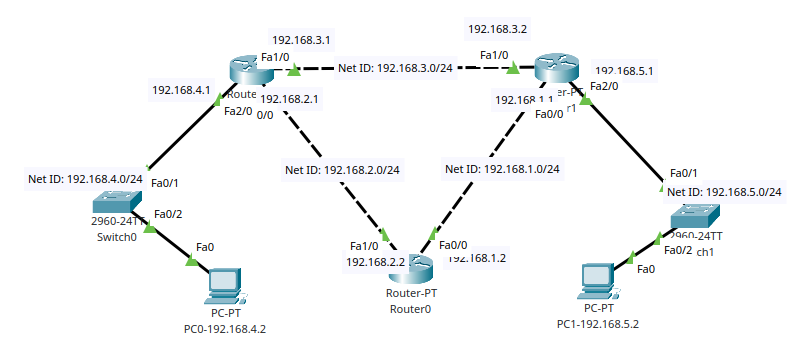
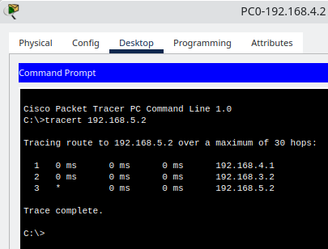

# Dynamic Routing With Protcol RIP

## A. Dynamic Routing

Dynamic routing adalah suatu metode routing yang memungkinkan router untuk mengetahui rute ke suatu jaringan tanpa harus dikonfigurasi secara manual. Dynamic routing menggunakan routing protocol untuk menentukan rute ke suatu jaringan. Routing protocol yang digunakan dalam percobaan kali ini adalah RIP (Routing Information Protocol). Cara Kerja Dynamic Routing adalah sebagai berikut:

1. Router mengirimkan routing table ke semua router yang terhubung pada jaringan.
2. Router yang menerima routing table akan melakukan update routing table sesuai dengan routing table yang diterima.
3. Setelah update routing table, router akan mengirimkan routing table yang sudah diupdate ke semua router yang terhubung pada jaringan.
4. Langkah 2 dan 3 akan terus berulang sampai semua router pada jaringan memiliki routing table yang sama.

## B. Routing Information Protocol (RIP)

RIP adalah suatu routing protocol yang digunakan untuk melakukan routing pada jaringan IP. RIP menggunakan metode distance vector untuk menentukan rute ke suatu jaringan.

Metode distance vector ini adalah metode routing yang menggunakan vektor jarak untuk menentukan rute ke suatu jaringan. Vektor jarak ini merupakan jarak dari router ke suatu jaringan. Vektor jarak ini disebut dengan hop count. Hop count adalah jumlah router yang dilewati untuk menuju suatu jaringan.

RIP juga menggunakan metode broadcast untuk melakukan update routing table dan metode split horizon untuk menghindari routing loop. Cara kerja RIP yaitu dengan menghitung jarak dari router ke suatu jaringan dengan cara menghitung jumlah router yang dilewati untuk menuju suatu jaringan. Jika router yang dilewati lebih sedikit, maka jaraknya akan lebih dekat. Jarak yang lebih dekat akan lebih diutamakan untuk forwarding suatu paket daripada jarak yang lebih jauh.

## Praktek Dynamic Routing (RIP)

### Topologi

Topologi di atas sama seperti minggu sebelumnya yang berbeda yakni penggunanan dynamic routing dengan RIP. Minggu sebelumnya menggunakan static routing.

### 2. Konfigurasi IP Router

| Devices  | Interface |     IP      |
| :------: | :-------: | :---------: |
| Router 0 |   Fa0/0   | 192.168.2.2 |
|          |   Fa0/1   | 192.168.1.2 |
| Router 1 |   Fa0/0   | 192.168.1.1 |
|          |   Fa0/1   | 192.168.3.2 |
|          |   Fa0/2   | 192.168.4.1 |
| Router 2 |   Fa0/0   | 192.168.2.1 |
|          |   Fa0/1   | 192.168.3.1 |
|          |   Fa0/2   | 192.168.5.1 |

### 3. Konfigurasi IP PC

| Devices | Interface |     IP      |
| :-----: | :-------: | :---------: |
|   PC0   |   Fa0/0   | 192.168.4.2 |
|   PC1   |   Fa0/0   | 192.168.5.2 |

### 4. Konfigurasi Routing (RIP)

| Devices  |   Netowrk   |
| :------: | :---------: |
| Router 0 | 192.168.1.0 |
|          | 192.168.2.0 |
| Router 1 | 192.168.1.0 |
|          | 192.168.3.0 |
|          | 192.168.5.0 |
| Router 2 | 192.168.2.0 |
|          | 192.168.3.0 |
|          | 192.168.4.0 |

Contoh perintah yang digunakan pada router 0 untuk mengaktifkan RIP adalah sebagai berikut:

        Router(config)#router rip
        Router(config-router)#network 192.168.1.0
        Router(config-router)#network 192.168.2.0

### 5. Testing

Terlihat lintasan yang dilalui oleh paket yang dikirimkan dari PC0 ke PC1 adalah sebagai berikut:

1. PC0 mengirimkan paket ke router 1.
2. Router 2 menerima paket dan mengirimkan paket ke router 1.
3. Router 2 menerima paket dan mengirimkan paket ke PC1.
4. PC1 menerima paket.

Tracert di atas ialah percobaan yang pertama kali jadi belum ada routing table yang ada di router 2. Routing table akan terupdate setelah router 2 menerima routing table dari router 1. Terdapat jeda waktu disana karena routing table belum terupdate.
